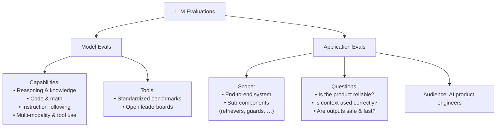
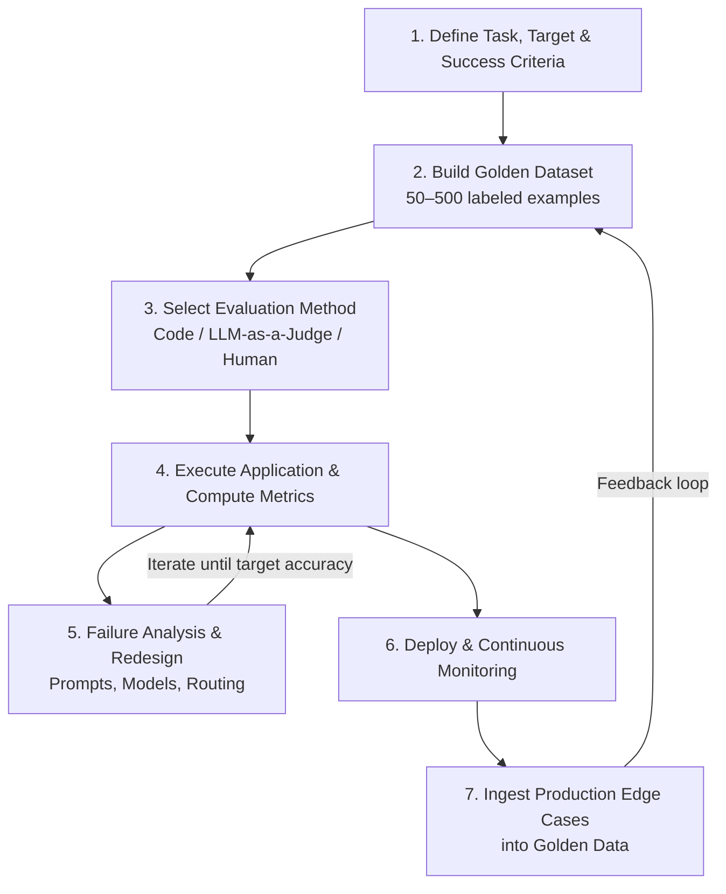
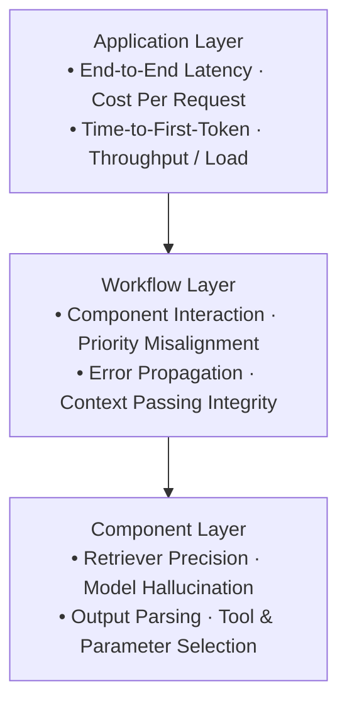
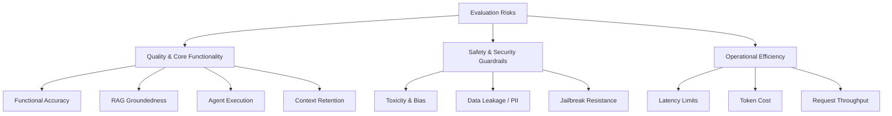
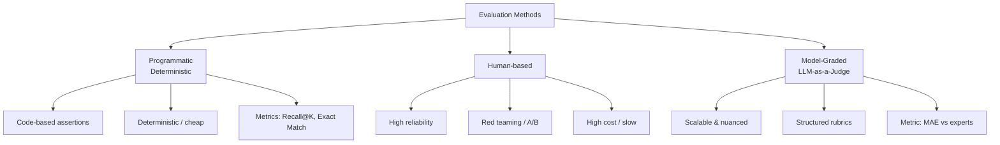
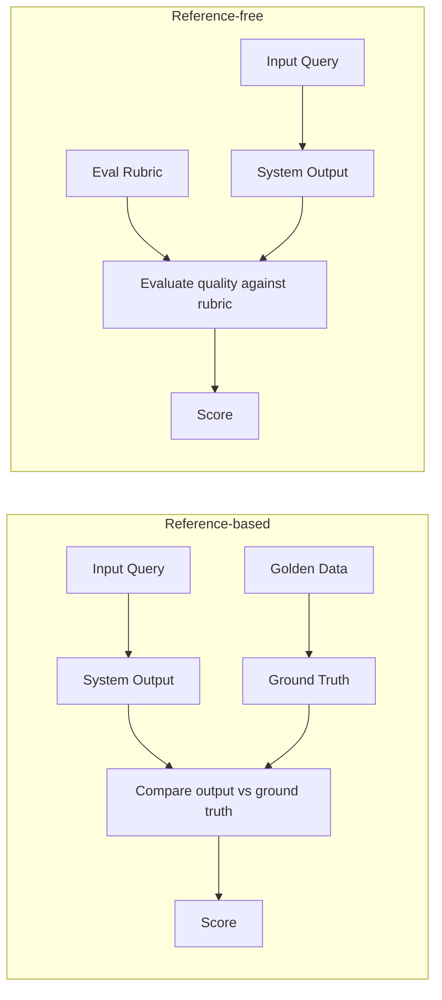

# LLM Evaluations

LLM evaluations are a **systematic**, **repeatable** testing setup used to judge an LLM or LLM-powered system against clear criteria. They are what separate hobby projects from reliable, production-grade AI systems.

## Why evaluations matter

### Beyond vibe testing

Most developers rely on **vibe testing**—casually asking a few random questions and judging the response by feel. That approach is subjective, unrepeatable, and insufficient for production.

Moving from personal projects to production-grade applications requires systematic verification for reliability, safety, and performance at scale.

### Risks of unevaluated AI systems

Deploying without structured evaluation leads to critical failure modes:

1. **Hallucinations & financial liability** — Chatbots can state incorrect policies; the organization remains responsible for the AI’s output.
   - _Example:_ Air Canada’s chatbot hallucinated a refund policy; the company had to honor a discount it never offered.
2. **Jailbreaking & security** — Unchecked prompt interactions let users bypass business logic and extract invalid commitments.
   - _Example:_ A Chevrolet dealership chatbot was jailbroken into agreeing to sell a car for $1, creating a PR crisis.
3. **Fabricated data** — Unverified outputs in professional contexts can invent non-existent facts, with operational penalties and loss of credibility.
   - _Example:_ A lawyer used ChatGPT to invent fake court cases, leading to fines and professional sanctions.

### Why LLM evaluation differs from traditional software testing

- **Probabilistic vs deterministic** — Standard software yields predictable outputs for fixed inputs. LLMs are non-deterministic: the same input can produce different, potentially valid responses.
- **Multi-dimensional metrics** — Code testing mainly checks logic correctness. LLM evaluation measures several dimensions at once:
  - **Accuracy & groundedness** — Factuality and source alignment
  - **Response quality** — Tonality, completeness, and relevance
  - **Performance & cost** — Latency, token usage, and runtime expense

## Model evals vs application evals

An **eval is not a metric**. Accuracy or recall is one piece; an LLM eval is the full testing setup:

1. **Target** — What you’re testing (retrieval module, prompt, fine-tuned model, full app)
2. **Dataset** — Curated inputs covering real usage and edge cases
3. **Scoring** — Rubrics or automated metrics (accuracy, safety, groundedness, conciseness, …)
4. **Execution** — Tools (e.g. Ragas, DeepEval) and when you run them (pre-deploy vs continuous production monitoring)

That setup is **systematic** (curated coverage, not casual inspection), **repeatable** (same tests after prompt/model/vector-store/logic changes), and **criteria-driven** (explicit standards, not vibe checks).

Evals split by _what_ you evaluate:

### Model evals

Evaluate the **raw capabilities** of the foundation model itself. Usually run by research labs; engineers mainly use the scores to pick a base model.

| Capability                | What it tests                              | Example benchmarks   |
| ------------------------- | ------------------------------------------ | -------------------- |
| Reasoning & knowledge     | General understanding                      | MMLU                 |
| Mathematics               | Step-by-step numeric reasoning             | GSM8K                |
| Coding                    | Generation and bug fixing                  | HumanEval, SWE-bench |
| Instruction following     | Adherence to complex constraints           | IFEval               |
| Long-context              | Finding info in large windows              | Needle In A Haystack |
| Multi-modality & tool use | Images/audio; correct tool-call formatting | —                    |

### Application evals

Evaluate the **entire system around the model**: UI, prompt templates, vector DB, retrieval, guardrails, agent orchestration—and individual components (e.g. retriever accuracy separate from generation quality).

A strong processor does not make a good phone without camera, OS, and battery. Likewise, a strong base LLM does not make a working product without testing the surrounding architecture.

Questions application evals answer:

- Is the RAG answer strictly grounded in retrieved context?
- Is latency acceptable for production users?
- Did a system-prompt change improve quality without side effects?
- Is output safe, compliant, and cost-efficient?

**Application evals are the primary focus for AI engineers shipping products.**

They typically cover:

1. **Foundational landscape** — Ecosystem, tooling, model vs application evals
2. **Model benchmarks** — Choosing / comparing foundation models
3. **Custom pipelines** — Domain golden datasets and scoring rubrics
4. **Specialized evals**
   - **RAG** — Retrieval precision, context relevance, answer faithfulness
   - **Agentic** — Multi-step reasoning, tool use, execution success
5. **Safety & guardrails** — Red-teaming, prompt injection, harmful outputs
6. **Operational monitoring** — TTFT, throughput (tokens/sec), system load, latency drift

## End-to-end application evaluation lifecycle

Evaluating an LLM-powered system follows an iterative engineering lifecycle. Changes to prompts, models, parameters, or retrieval pipelines should show measurable improvement before deployment.

### 1. Problem formulation & metric selection

- **Target definition** — Identify the exact boundary being tested, e.g.:
  - End-to-end output quality
  - Router performance
  - Context retrieval accuracy
- **Criteria & metrics** — Define success quantitatively:
  - **Simple classification** (e.g. routing support emails to billing / tech / general) → metrics like accuracy
  - **Free-form / generation** → multi-dimensional criteria such as faithfulness, groundedness, hallucination rate

### 2. Golden dataset curation

- **Composition** — High-quality test set, typically **50–500** representative rows
- **Ground truth (golden labels)** — From historical production data or manually vetted domain inputs with expected answers
- **Coverage** — Standard user intents, ambiguous phrasing, and hard edge cases

### 3. Evaluation method selection

Who scores the outputs:

| Method                | How it works                                                                                              | Tradeoffs                                                                              |
| --------------------- | --------------------------------------------------------------------------------------------------------- | -------------------------------------------------------------------------------------- |
| **Code-based rules**  | Automated assertions: string matching, JSON format validation, regex, classification accuracy             | Fast, deterministic, cheap                                                             |
| **LLM-as-a-judge**    | Stronger model + structured rubrics scores open-ended semantic outputs when code assertions aren’t enough | Flexible for free text; needs calibration                                              |
| **Human-in-the-loop** | Subject-matter experts inspect outputs                                                                    | Highly accurate; expensive and slow — mainly for spot-checks or calibrating LLM judges |

### 4. Execute & score

- Run the current pipeline version against the **full golden dataset**
- Compute the chosen evaluation metrics on every row

### 5. Failure analysis & redesign (iterate)

This is the loop between steps 4 and 5 until target accuracy is met:

- **Result analysis** — Isolate failing rows (e.g. misclassified routing tags, hallucinated facts)
- **System refinement** — Based on root causes, adjust system prompts, change base LLM, tune chunking sizes, or update routing logic
- **Regression testing** — Re-run against the **same** golden dataset to confirm improvements without breaking previously passing cases

### 6. Deploy & continuous monitoring

- **Production deployment** — Release once metric thresholds are met
- **Runtime monitoring** — Track operational metrics (latency, token costs) alongside functional accuracy via telemetry or user feedback (e.g. downvotes, support escalation flags)

### 7. Production flywheel → golden data

**Flywheel effect:** Pull misclassified inputs and edge-case failures from live production logs, label them, and ingest them back into the golden dataset. That continually hardens the suite against real-world drift and feeds step 2.

### Multi-eval architecture

A single LLM app rarely uses one eval pipeline. Production systems run **multiple parallel evals** at different layers:

| Layer                     | Focus                | Examples                                                 |
| ------------------------- | -------------------- | -------------------------------------------------------- |
| **1. Component**          | Isolated modules     | Retriever precision separate from generator output       |
| **2. System**             | End-to-end behavior  | Task completion, answer faithfulness                     |
| **3. Guardrail & safety** | Policy / abuse       | Toxicity, policy violations, prompt-injection resilience |
| **4. Operational**        | Runtime cost & speed | Latency budgets, TTFT, per-request token spend           |

# Multi-Layer Failure Modes in AI Systems

A single LLM-powered application cannot rely on a single evaluation pipeline. Because modern AI applications consist of interconnected components, failure can occur across distinct architectural layers:

---

### Architectural Levels of Failure

#### 1. Component-Level Failures

Focuses on individual, isolated modules within the application:

- **Retrievers:** Fetching irrelevant context chunks or missing critical information.
- **Generators:** Hallucination, failure to follow system prompts, or ignoring instructions.
- **Tools & Parsers:** Invoking APIs with incorrect syntax, missing parameters, or output parsing failures.

#### 2. Workflow & Interaction Failures

Occurs when individual components function properly in isolation, but fail during integration:

- **Priority Misalignment Example:** In a RAG architecture, a retriever may successfully fetch 5 context blocks (including the correct answer in position 5). However, if the generation prompt prioritizes the top positions, the generator may construct an incorrect answer using weaker context from positions 1–4.
- **Error Propagation:** Slight drift in prompt formatting or context retrieval early in a chain causes compounding errors downstream.

#### 3. Application & Operational Failures

Focuses on systemic performance and user experience metrics across the complete product:

- **Latency Budgets:** A pipeline that returns accurate, grounded responses but takes 12 seconds per turn is unusable in production.
- **Cost Efficiency:** Excessive token usage or redundant LLM calls driving cost per query beyond budgeted limits.

---

### Comprehensive Taxonomy of Evaluation Risk Categories

Evaluation pipelines must be tailored to address three distinct dimensions of system risk:

#### 1. Functional Quality & Accuracy

- **General LLM Tasks:** Response correctness, conciseness, instruction adherence, and format compliance.
- **RAG Systems:** Context relevance (retrieval quality), answer groundedness/faithfulness (zero hallucination), and citation accuracy.
- **Agentic Frameworks:** Tool choice correctness, argument parameter accuracy, task completion rate, and error recovery resilience.
- **Multi-Turn Chatbots:** Context retention across long conversation threads and proactive intent clarification.

#### 2. Safety & Security Guardrails

- **Toxicity & Harm:** Filtering offensive language, hate speech, or dangerous instructions (e.g., self-harm, illegal acts).
- **Data Leakage:** Preventing PII, credential leakage, or unauthorized system prompt disclosures.
- **Adversarial Resilience:** Robustness against prompt injection, jailbreaking techniques, and system override attempts.

#### 3. Operational Performance

- **Latency Tracking:** Time-To-First-Token (TTFT), overall response duration, and latency under high concurrent loads.
- **Resource Cost:** Token consumption metrics, cost-per-query tracking, and cache hit ratios.

## Evaluation execution mechanisms & reference frameworks

Evaluation pipelines are driven by **three execution mechanisms**, and structured around **two data-reference strategies**.

### Core execution mechanisms

### 1. Programmatic / deterministic evaluation

- **Mechanism** — Deterministic code logic, regular expressions, or mathematical formulas
- **Best used for** — Component-level checks, structured classifications, retrieval system validation
- **Pros / cons** — Extremely fast and cheap; cannot evaluate free-form, subjective, or open-ended semantic text

#### Example: retrieval evaluation via Recall@K

**Objective:** Test whether a RAG retriever fetches correct chunks from a vector database given $K=5$.

$$\text{Recall}@K = \frac{\text{Number of Relevant Retrieved Chunks}}{\text{Total Known Relevant Chunks}}$$

**Workflow:**

1. Input queries to the retriever module
2. Compare returned chunk IDs against predefined ground-truth chunk IDs via Python assertions
3. Calculate mean Recall@K across the evaluation dataset

### 2. Human-based evaluation

- **Mechanism** — Subject-matter experts or end-users evaluate model outputs directly
- **Pros / cons** — Highly reliable, nuanced, gold-standard judgment; expensive, slow, and non-scalable for continuous automated testing

**Key modalities:**

- **Direct grading / rubric scoring** — Experts score outputs (e.g. 1–5) on completeness, tone, etc.
- **Red teaming** — Adversarial testing to break guardrails and surface vulnerabilities
- **A/B testing in production** — Live end-user feedback (thumbs up/down, preference selection)
- **Human-in-the-loop** — Route edge cases or low-confidence outputs to human reviewers

### 3. Model-graded evaluation (LLM-as-a-judge)

- **Mechanism** — An advanced LLM (e.g. GPT-4o, Claude 3.5 Sonnet) with explicit scoring rubrics evaluates candidate outputs
- **Best used for** — Complex, open-ended semantic evaluation where programmatic rules fail but human grading is too costly
- **Pros / cons** — Scalable, nuanced, and fast; needs careful prompt design and calibration against human baselines to limit judge bias or drift

#### Example: automated essay scoring alignment

**Objective:** Align an AI grading engine against human subject-matter experts.

**Workflow:**

1. **Golden dataset** — Sample 50–100 student responses graded manually by experts ($Score_{\text{Human}}$)
2. **Rubric definition** — Multi-dimensional criteria (e.g. structure, argument, evidence)
3. **Judge prompt execution** — Pass candidate answers + rubric to the LLM judge → $Score_{\text{LLM}}$
4. **Alignment metric (MAE):**

$$\text{MAE} = \frac{1}{N} \sum_{i=1}^{N} \lvert Score_{\text{LLM}, i} - Score_{\text{Human}, i} \rvert$$

5. **Optimize** — Minimize MAE via prompt engineering, rubric refinement, or switching judge models

### Reference-based vs reference-free frameworks

### 1. Reference-based evals

- **Definition** — Compare application output to a known ground-truth / reference answer in the dataset
- **Data state** — Golden dataset holds pairs: $(\text{Input Query}, \text{Expected Output})$

**Examples:**

- Retriever outputs vs known relevant chunk IDs (Recall@K)
- AI-generated summary key points vs a human-authored summary
- MAE between LLM-as-a-judge scores and ground-truth human expert scores

### 2. Reference-free evals

- **Definition** — Score output quality with predefined criteria / rubrics, without a per-item ground-truth answer
- **Data state** — Dataset holds inputs $(\text{Input Query})$ only — no expected target outputs

**Examples:**

- Rate helpfulness, politeness, or tone on a 1–5 rubric
- Check toxicity, PII leaks, or guardrail compliance
- **RAG faithfulness** — Verify generated text is supported _only_ by retrieved context, regardless of the exact wording
